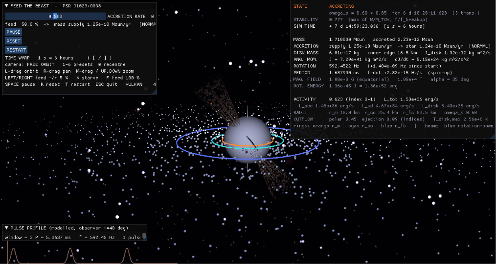

# Feed the Beast — The Life of a Neutron Star

Interactive Python + Taichi laboratory using the transitional millisecond
pulsar **PSR J1023+0038** as its reference star.  One control — the accretion
rate — drives a connected physical model:

    ACCRETION -> DISK ACTIVITY -> MASS / ANGULAR MOMENTUM -> ROTATION
              -> PULSAR FREQUENCY -> BEAM ROTATION -> RADIATION / OUTFLOW



Feed the star and watch the disk build, the magnetosphere shrink, the torque
turn positive and the pulse frequency creep up; starve it and the disk drains,
the accretion torque vanishes and dipole braking takes over.  The companion
star and the binary orbit are not modelled: matter is supplied at the disk
edge at the user-set rate.

## Setup & run

Requires Python 3.10+ and a GPU with Vulkan (falls back to CPU automatically).

```bash
git clone https://github.com/Prakha-63/feed-the-beast.git
cd feed-the-beast
pip install -r requirements.txt
python sim.py
```

| Action | Control |
|---|---|
| Feed / starve | ACCRETION RATE slider · `←` `→` (±5 %) · `X` starve · `F` feed 100 % |
| Time warp | `[` `]` (slow-motion 1 ms/s … 1 Myr/s; default 1 s = 6 h) |
| Camera | `1`–`6` presets · left-drag orbit · right-drag pan · middle-drag or `↑` `↓` zoom · `0` recentre |
| Simulation | `SPACE` pause/resume · `R` reset · `T` restart · `ESC` quit |

```bash
python sim.py --check        # scientific validation of the core equations
python sim.py --provenance   # full observed / computed / simplified table
python -m unittest discover -s tests
```

## What is observed, what is computed, what is a simplified model

Generated from `physics/provenance.py`, the machine-readable registry the
simulation itself uses (`--check` verifies that the registry matches
`config.py` and that every telemetry value is classified).  **Only rows typed
OBSERVED are measurements; OBSERVED-DERIVED values are inferred from timing
under standard assumptions; everything else is computed by this simplified
model and must not be read as an observation of PSR J1023+0038.**

Sources: [A09] Archibald et al. 2009, Science 324, 1411 · [D12] Deller et al.
2012, ApJ 756, L25 · [A13] Archibald et al. 2013, arXiv:1311.5161 · [S14]
Stappers et al. 2014, ApJ 790, 39 · [P14] Patruno et al. 2014, ApJ 781, L3.

| Quantity | Type | Source / Model | Units |
|---|---|---|---|
| Neutron-star spin period = 1.6879 | OBSERVED | [A09] radio timing (1.69 ms) | ms |
| Neutron-star mass = 1.71 | OBSERVED | [D12] orbital solution (1.71 +/- 0.16 Msun) | Msun |
| Spin-down power = 4.4e+34 | OBSERVED-DERIVED | [A13] from P, Pdot with I = 1e45 g cm^2 (~4.4e34 erg/s, Shklovskii-corrected) | erg/s |
| Surface dipole field (equatorial) = 1e+08 | OBSERVED-DERIVED | [A13] dipole spin-down estimate (~1e8 G; used as model input B0) | G |
| Observed states | OBSERVED | [A09][S14][P14] (radio-pulsar state (pre-2013) and sub-luminous disk state (2013-)) | - |
| Neutron-star radius = 12 | SIMPLIFIED MODEL | assumed canonical value (not measured for J1023) | km |
| Magnetic misalignment angle | SIMPLIFIED MODEL | assumed (35 deg; needed for a beam sweep) | deg |
| Moment of inertia = 0.4 | SIMPLIFIED MODEL | I = k M R^2, uniform sphere (k = 2/5) | - |
| Magnetospheric radius factor = 0.5 | SIMPLIFIED MODEL | r_m = xi r_A (standard 0.5) | - |
| Disk outer radius = 300000 | SIMPLIFIED MODEL | fixed disk edge where matter is supplied (3e5 km, assumed) | km |
| Disk inflow time = 1 | SIMPLIFIED MODEL | alpha-disk scaling t ~ r^1.5, total normalised (1 day) | d |
| Maximum transfer rate (100 %) = 1e-09 | SIMPLIFIED MODEL | slider range, cubic mapping (1e-9 Msun/yr, sub-Eddington) | Msun/yr |
| Field-burial mass scale = 0.001 | SIMPLIFIED MODEL | B = B0/(1 + dM/M_B) (Shibazaki et al. 1989 form) (1e-3 Msun) | Msun |
| Maximum neutron-star mass = 2.2 | SIMPLIFIED MODEL | assumed EOS limit (2.2 Msun) | Msun |
| State thresholds (fastness) = 0.85 | SIMPLIFIED MODEL | ACCRETING < 0.85 <= TRANSITION <= 1.15 < PROPELLER (chosen bands) | - |
| Beam half-angle = 12 | SIMPLIFIED MODEL | Gaussian beam pattern (physics/radiation.py) | deg |
| Observer inclination = 40 | SIMPLIFIED MODEL | assumed line of sight (physics/radiation.py) | deg |
| Radio quench factor with disk = 0.25 | SIMPLIFIED MODEL | observed-inspired (radio pulsar hidden in disk state) (constant factor) | - |
| Polar outflow: accretion-power fraction = 0.1 | SIMPLIFIED MODEL | P_polar = L_sd + f L_acc (0.1) | - |
| Polar wind speed = 0.3 | SIMPLIFIED MODEL | assumed bulk speed (physics/outflow.py) | c |
| Neutron-star mass [mass_msun] | COMPUTED | dM/dt = f_acc Mdot_disk | Msun |
| Angular momentum [J] | COMPUTED | dJ/dt = Jdot_acc - Jdot_loss | kg m^2/s |
| Rotation frequency [freq_hz] | COMPUTED | f = 1/P, P = 2 pi I / J | Hz |
| Rotation period [period_ms] | COMPUTED | P = 2 pi / Omega | ms |
| Frequency derivative [fdot_hz_s] | COMPUTED | (Jdot/I - Omega Mdot/M) / 2 pi | Hz/s |
| Rotational energy [E_rot_J] | COMPUTED | 1/2 I Omega^2 | J |
| Surface field (evolved) [B_gauss] | COMPUTED | B0 / (1 + dM/M_B) | G |
| Magnetospheric radius [r_m_km] | COMPUTED | xi (2 pi B^2 R^6 / (mu0 Mdot sqrt(2GM)))^(2/7) | km |
| Corotation radius [r_co_km] | COMPUTED | (GM/Omega^2)^(1/3) | km |
| Light-cylinder radius [r_lc_km] | COMPUTED | c / Omega | km |
| Fastness parameter [fastness] | COMPUTED | (r_m/r_co)^(3/2) | - |
| Accretion luminosity [L_acc_W] | COMPUTED | G M Mdot_ns / R | W |
| Spin-down luminosity [L_sd_W] | COMPUTED | (8 pi/3) B^2 R^6 Omega^4 sin^2 alpha / (mu0 c^3) | W |
| Activity index [activity] | COMPUTED | log_index(L_acc + L_sd) | 0-1 |
| Rate onto the star [mdot_ns_msun_yr] | COMPUTED | f_acc Mdot_disk | Msun/yr |
| Disk mass [disk_mass_kg] | COMPUTED | sum of ring masses | kg |
| Disk peak temperature [disk_T_max_K] | COMPUTED | Shakura-Sunyaev T(r) from local flux | K |
| System state [state] | COMPUTED | criteria on Mdot_disk, r_m, r_lc, omega_s | - |
| Pulse frequency [pulse_frequency_hz] | COMPUTED | = f | Hz |
| Polar outflow index [outflow_polar_index] | COMPUTED | log_index(P_polar) | 0-1 |

The complete list (every telemetry value) is printed by `python sim.py --provenance`.

## Approximations

- The neutron star is a rigid sphere with I = (2/5) M R^2; gravity is Newtonian.
- The magnetic field is an idealized rotating dipole (visualized field lines,
  no MHD); B decays with accreted mass by a simple burial law.
- The accretion torque is the simplified Ghosh–Lamb form Mdot sqrt(G M r_m)(1 − omega_s);
  the only loss mechanism is vacuum dipole braking.
- The disk is 32 Keplerian rings with alpha-disk viscous inflow and
  Shakura–Sunyaev temperatures; matter enters at a fixed outer radius.
- Radiation beams, pulse profile and particle outflow are lightweight
  visualizations tied to computed luminosities and rates, not radiative-transfer.
- Rendering uses a log-compressed radius; distances are not to scale.

Units: SI internally (kg, m, s, T, W); the HUD shows Msun, km, ms, Hz, G, erg/s.
